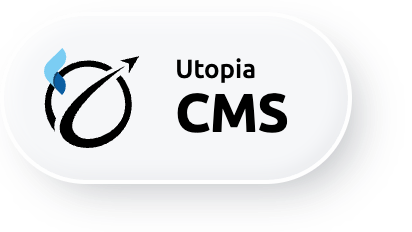

[![license: BSD-2-Clause][license_badge]][license_link]

# utopia-cms

A Claude Code and Codex plugin for building Flutter CMS / admin panels with [utopia_cms](https://pub.dev/packages/utopia_cms) - the CmsWidget shell, CmsTablePage, and delegates for Firebase / Supabase / Hasura / GraphQL - with a PostToolUse hook that flags hand-rolled admin tables.

The cost of the pattern it guards against is measured: in one real-world incident, a hand-rolled admin produced roughly 970 lines (screen + state class + view + custom dialog) for a single CRUD page that a `CmsTablePage` covers in about 80.

## What's inside

- The `utopia-cms` skill, plus 11 reference files: anti-patterns, the CmsWidget shell, table pages, delegates, the entry catalog, filters, actions, management sections, theming, to-many relationships, and media.
- A SessionStart hook for admin-project detection.
- A PostToolUse hook that is a self-contained anti-pattern engine (8 rules, no external analyzer).

No commands and no agents.

## Installation

```bash
# Claude Code
/plugin marketplace add Utopia-USS/utopia-flutter-skills
/plugin install utopia-cms@utopia-flutter-skills
```

```bash
# Codex
codex plugin marketplace add Utopia-USS/utopia-flutter-skills --ref main
codex plugin install utopia-cms@utopia-flutter-skills
```

### Requirements

`jq` for the PostToolUse hook (it parses the tool payload from stdin and exits silently without it), and a target project that depends on `utopia_cms` - none of the skill's rules apply otherwise.

## How it works

**SessionStart** fires when a `pubspec.yaml` declares `utopia_cms` or one of the delegate packages (`utopia_cms_firebase`, `_supabase`, `_hasura`, `_graphql`), or when the package name itself looks admin-like (`admin`, `cms`, `panel`, `backoffice`, `management`). Otherwise it exits 0 silently. On a hit it tells the session that admin tables, create/edit/delete flows, and per-row actions follow the CmsTablePage + CmsDelegate pattern from the skill.

**PostToolUse** runs on `Edit|Write|MultiEdit`, scoped to `.dart` files under `lib/` in a package that declares `utopia_cms` or has an admin-shaped name, and greps the edited file for the hand-rolled-admin family:

- Flutter `DataTable` in admin code.
- The `useState<List<T>?>` + `isLoading` + `error` triplet in a screen file with no `CmsTablePage`.
- CRUD service classes (load / create / update / delete) that never mention a `CmsDelegate`.
- Hand-rolled delete-confirmation `AlertDialog`s.
- Per-row `Icons.edit` + `Icons.delete` `IconButton`s inside a row builder.
- Deep imports of `package:utopia_cms/src/`.
- Plus two nudges: an admin-shaped package that never declares `utopia_cms`, and navigation resets (`pushNamedAndRemoveUntil`) pointed at admin routes.

Violations are reported to stderr, one line each, with a pointer into `anti-patterns.md`. The gate's mode is a single env var:

```bash
UTOPIA_CMS_MODE=block   # default is warn (exit 1); block makes violations exit 2
```

## Backends

| Backend | Package | Delegate |
|---|---|---|
| Firebase | `utopia_cms_firebase` | `CmsFirebaseDelegate` |
| Supabase | `utopia_cms_supabase` | `CmsSupabaseDelegate` |
| Hasura | `utopia_cms_hasura` | `CmsHasuraDelegate` |
| Plain GraphQL | `utopia_cms_graphql` | none prebuilt - write a custom `CmsDelegate` |

All of these live on pub.dev alongside [utopia_cms](https://pub.dev/packages/utopia_cms) itself.

## Related plugins

| Plugin | What it adds |
|---|---|
| [utopia-hooks](../utopia-hooks/) | Screen state management foundation - this skill scopes general state to it |
| [utopia-hooks-migrate-bloc](../utopia-hooks-migrate-bloc/) | BLoC to hooks migration of the app, not the admin |
| [utopia-design](../utopia-design/) | Design tokens and the generated theme layer |
| [utopia-ai-arch](../utopia-ai-arch/) | The project-level `.claude/` layer |

Built by [UtopiaSoftware](https://utopiasoft.io).

## Contributing

👾 Issues and PRs welcome - skills are designed to be forked: copy one into your own Claude Code or Codex setup, tweak the rules, ship it.

## License

BSD 2-Clause - see [LICENSE](../../LICENSE).

[license_badge]: https://img.shields.io/badge/license-BSD--2--Clause-2E8B57.svg
[license_link]: ../../LICENSE
